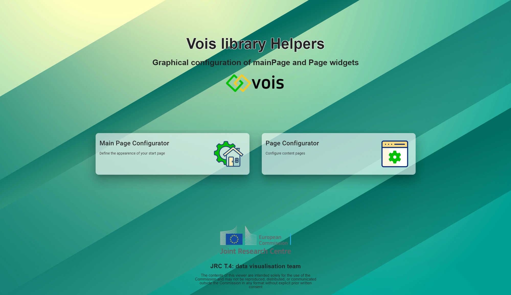
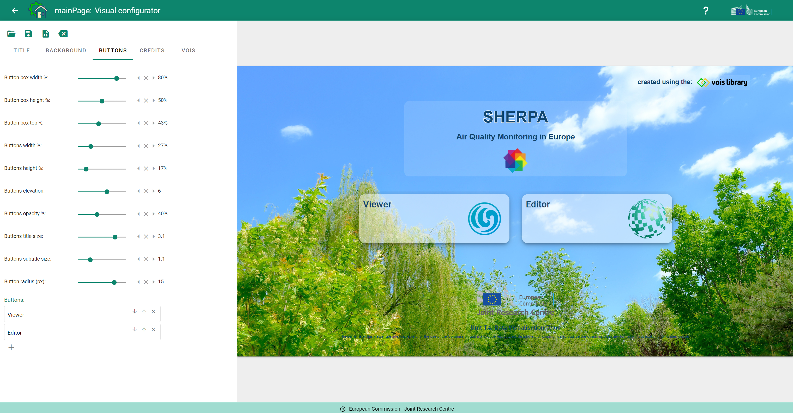
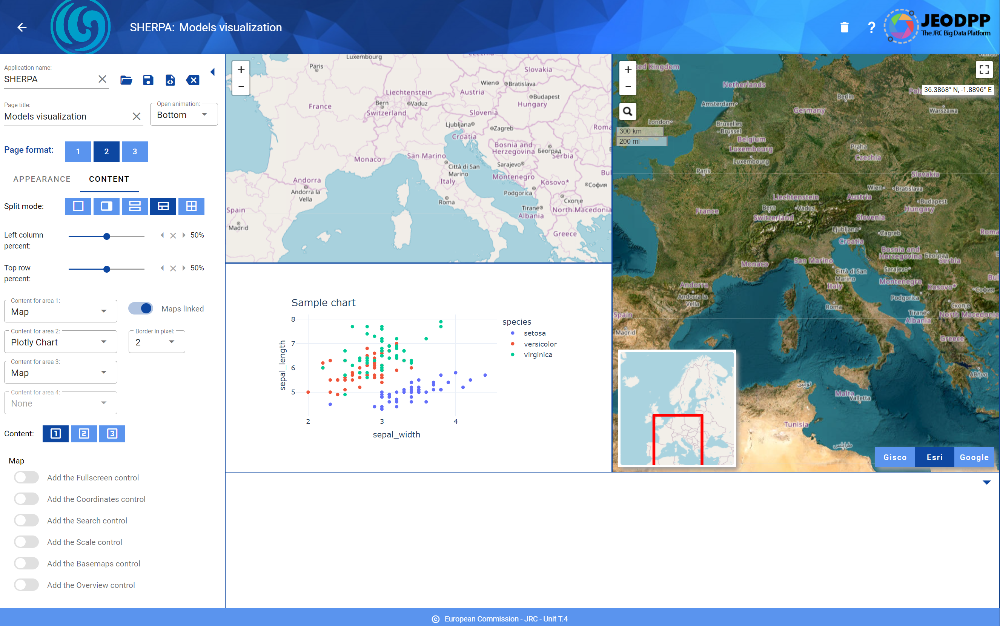

Python library to simplify the creation of impactful Voilà dashboards.

The online documentation for the vois library is available [here](https://vois.readthedocs.io/en/latest/1_intro.html)

The PDF documentation for the vois library is available [here](https://vois.readthedocs.io/_/downloads/en/latest/pdf/)

The source repository is available [here](https://code.europa.eu/jrc-bdap/vois)

The vois library contains:

package **vois**: helper functions for tasks not directly related to ipyvuetify (manage geojson files, create an interactive map to display custom geojson, simplify visualization of hierarchical data in Plotly, create custom SVG visualizations, etc.)

package **vois/vuetify**: classes to simplify the development of GUIs using ipyvuetify (each source file contains a wrapper to simplify the usage of a ipyvuetify widget)

## License

VOIS library is released under a
[EUPL Version 1.2](https://joinup.ec.europa.eu/collection/eupl/eupl-text-eupl-12) license.

## Setup

The vois library can be installed using this command:

`pip install vois`

## News

In order to help new users of the vois library to start using the library without the need to read all the documentation, we have created two dashboards that help in visually define a multipage application structure.

These tools are deployed as Voilà dashboards in Microsoft Azure Cloud at this URL: https://vois.azurewebsites.net/

The "Main Page Configurator" is a visual tool to create the starting page of a multipage application, by visually position titles, logos, buttons, credits on top of a background image. Sixty predefined background images are available but also custom background images can be uploaded. The result of the visual configuration can be saved locally as a json file and a notebook .ipynb file and immediately used as the first building block of your application.

The "Page Configurator" enables the visual configuration of one of your application pages. Users can define the colors, the logos, the content of the page (one or more maps, charts, drawings, etc.) and the number of panels that will contain the widgets that control the application behaviour. Once done, the page configuration can be downloaded locally as a json file, a pyton file and a notebook, and immediately used in JupyterLab.

Example of a page with a left panel and a bottom panel. The content of the page consists of two maps and a chart.

## Tutorial

The tutorial section of the documentation available [here](https://vois.readthedocs.io/en/latest/2_tutorial.html) provides a step by step example for the construction of a dashboard to display EUROSTAT data on Energy Consumption in Europe.

These are the links to all the steps of the example dashboard deployed and published by Hugginface Spaces:

[Step.1: Creation of the dashboard structure using the app class](https://davidedemarchi-voila.hf.space/voila/render/tutorial/EnergyConsumption.1.ipynb)

[Step.2: Use Pandas to read the input CSVs and display the DataFrame as a table](https://davidedemarchi-voila.hf.space/voila/render/tutorial/EnergyConsumption.2.ipynb)

[Step.3: Add the filtering controls to the dashboard to select countries and sector](https://davidedemarchi-voila.hf.space/voila/render/tutorial/EnergyConsumption.3.ipynb)

[Step.4: Add the Plotly Bar Chart View](https://davidedemarchi-voila.hf.space/voila/render/tutorial/EnergyConsumption.4.ipynb)

[Step.5: Add the SVG Static Map View](https://davidedemarchi-voila.hf.space/voila/render/tutorial/EnergyConsumption.5.ipynb)

[Step.6: Add the Dynamic Map View](https://davidedemarchi-voila.hf.space/voila/render/tutorial/EnergyConsumption.6.ipynb)

[Step.7: Add the functions for downloading chart, table and map](https://davidedemarchi-voila.hf.space/voila/render/tutorial/EnergyConsumption.7.ipynb)

[Step.8: Manage the parameters passsed in the URL and open external URLs](https://davidedemarchi-voila.hf.space/voila/render/tutorial/EnergyConsumption.8.ipynb)

[Step.9: Add an interactive AnimatedPieChart in SVG to select the consumption sector](https://davidedemarchi-voila.hf.space/voila/render/tutorial/EnergyConsumption.9.ipynb)

[Step.Final: Add minipanel to footer bar and the function to generate and download a report in docx format](https://davidedemarchi-voila.hf.space/voila/render/tutorial/EnergyConsumption.Final.ipynb)

[Step.Final.Dark: Dark version of the final dashboard](https://davidedemarchi-voila.hf.space/voila/render/tutorial/EnergyConsumption.Final.ThemeDark.ipynb)

An example multi-page dashboard can be viewed at this link: [Example multi-page dashboard](https://davidedemarchi-voila.hf.space/voila/render/tutorial/MultipageDemo.ipynb)

