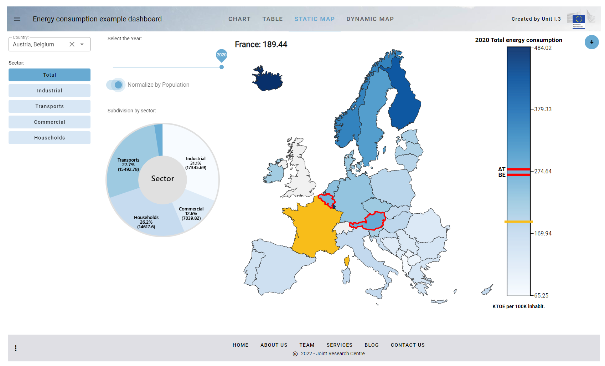

Python library to simplify some common tasks related to the creation of advanced Voilà dashboards inside the JRC Big Data Analytics Platform (BDAP).

The online documentation for vois library is available [here](https://jeodpp.jrc.ec.europa.eu/services/shared/vois/)

The vois library contains:

folder **vois**: helper functions for tasks not directly related to ipyvuetify (manage geojson files, create an interactive map to display custom geojson, simplify visualization of hierarchical data in Plotly, create custom SVG visualizations, etc.)

folder **vois/vuetify**: classes to simplify the development of GUIs using ipyvuetify (each source file contains a wrapper to simplify the usage of a ipyvuetify widget)


## License

VOIS library is released under a
[EUPL Version 1.2](https://joinup.ec.europa.eu/collection/eupl/eupl-text-eupl-12) license (see
[LICENSE](LICENSE))


## Examples

The **examples/notebooks** subfolder contains one notebook for each of the source modules of the vois library. All the examples used in the Reference Manual of the online documentation are reported into these notebooks, for instance the examples described [here](https://jeodpp.jrc.ec.europa.eu/services/shared/vois/3.1_referenceGeneral.html#module-colors) can be found in **examples/notebooks/colors.ipynb**

The **examples/EnergyConsumption** subfolder contains a complete step-by-step dashboard that displays EUROSTAT data on Energy Consumption in Europe.

Screenshot of the final version of the example dashboard:



These are the links to all the steps of the example dashboard deployed and published by the BDAP Voilà server:

[Step.1: Creation of the dashboard structure using the app class](https://jeodpp.jrc.ec.europa.eu/eu/dashboard/voila/render/Vaas/EnergyConsumption/EnergyConsumption.1.ipynb)

[Step.2: Use Pandas to read the input CSVs and display the DataFrame as a table](https://jeodpp.jrc.ec.europa.eu/eu/dashboard/voila/render/Vaas/EnergyConsumption/EnergyConsumption.2.ipynb)

[Step.3: Add the filtering controls to the dashboard to select countries and sector](https://jeodpp.jrc.ec.europa.eu/eu/dashboard/voila/render/Vaas/EnergyConsumption/EnergyConsumption.3.ipynb)

[Step.4: Add the Plotly Bar Chart View](https://jeodpp.jrc.ec.europa.eu/eu/dashboard/voila/render/Vaas/EnergyConsumption/EnergyConsumption.4.ipynb)

[Step.5: Add the SVG Static Map View](https://jeodpp.jrc.ec.europa.eu/eu/dashboard/voila/render/Vaas/EnergyConsumption/EnergyConsumption.5.ipynb)

[Step.6: Add the Dynamic Map View](https://jeodpp.jrc.ec.europa.eu/eu/dashboard/voila/render/Vaas/EnergyConsumption/EnergyConsumption.6.ipynb)

[Step.7: Add the functions for downloading chart, table and map](https://jeodpp.jrc.ec.europa.eu/eu/dashboard/voila/render/Vaas/EnergyConsumption/EnergyConsumption.7.ipynb)

[Step.8: Manage the parameters passsed in the URL and open external URLs](https://jeodpp.jrc.ec.europa.eu/eu/dashboard/voila/render/Vaas/EnergyConsumption/EnergyConsumption.8.ipynb)

[Step.9: Add an interactive AnimatedPieChart in SVG to select the consumption sector](https://jeodpp.jrc.ec.europa.eu/eu/dashboard/voila/render/Vaas/EnergyConsumption/EnergyConsumption.9.ipynb)

[Step.Final: Add minipanel to footer bar and the function to generate and download a report in docx format](https://jeodpp.jrc.ec.europa.eu/eu/dashboard/voila/render/Vaas/EnergyConsumption/EnergyConsumption.Final.ipynb)

[Step.Final.Dark: Dark version of the final dashboard](https://jeodpp.jrc.ec.europa.eu/eu/dashboard/voila/render/Vaas/EnergyConsumption/EnergyConsumption.Final.ThemeDark.ipynb)


## Dependencies

The vois library is primarily intended to be used inside JEO-lab, the JupyterLab environment of JRC BDAP.

The main dependencies are:

ipyvuetify (https://github.com/widgetti/ipyvuetify)

ipywidgets (https://ipywidgets.readthedocs.io/en/stable/)

ipyleaflet (https://ipyleaflet.readthedocs.io/en/latest/)

The **interapro** BDAP library (https://jeodpp.jrc.ec.europa.eu/services/processing/interhelp/) is used only in the module interMap (the same functions are available from the module leafletMap that is based on ipyleaflet)

All these dependencies are already installed inside the "Interactive Processing - JupyterLab - Python 3" docker image that is available on JEO-lab (https://jeodpp.jrc.ec.europa.eu/jhub/)

The same docker image is used by the BDAP Voilà servers.

## Install

The vois library is already installed inside the docker image used in JEO-lab ("InteractiveProcessing - JupyterLab - Python 3", which is the first of the list of images available in the Notebook Manager) and in Voilà.

The library can also be used by copying all the python source file contained in the folder named "vois" and "vois/vuetify" under the notebook that contains the Voilà dashboard to be deployed. 

The script in **script/copyto** can be used to copy an updated version of the vois library to another folder

To copy the source code into the deploy folder, run this command from the root folder of this repository:

```
./scripts/deploy
```


## Documentation

All the source python .py file have accompanying .ipynb notebooks files that contain examples on how to use the methods or classes. They can be used for testing the developments on the single modules of the library.

To build the latest documentation from source, install these dependencies:

* pip install -U sphinx
* pip install sphinx_rtd_theme
* pip install sphinxcontrib-bibtex
* pip install sphinx-copybutton

Go to directory `docs` and run `make html`.

```
cd docs
make html
```

After compilation, in order to put the documentation in production, open a JEO-desk terminal and execute these commands:


```
cd docs
cp -r _build/html/* /mnt/cidstorage/cidweb/www/services/shared/vois/
```


The documentation is generated in html format in `_build/html` and can be read with your browser (open `index.html`).

Sources of information on how to write or update the documentation can be found following these links:

https://python-docs.readthedocs.io/en/latest/writing/documentation.html

https://realpython.com/documenting-python-code/

https://numpydoc.readthedocs.io/en/latest/format.html

https://jupyterbook.org/en/stable/intro.html

https://sphinxcontrib-napoleon.readthedocs.io/en/latest/example_numpy.html

https://sublime-and-sphinx-guide.readthedocs.io/en/latest/index.html

https://www.sphinx-doc.org/en/master/usage/restructuredtext/domains.html#cross-referencing-python-objects

General documentation guidance:

https://documentation.divio.com/


## Tests

Unit tests are done using unittest python test runner. See documentation at https://realpython.com/python-testing/

At the moment only simple tests are implemented in the test.py module (root folder)

To execute the tests, please run:

```
python test.py
```

from the root folder.
