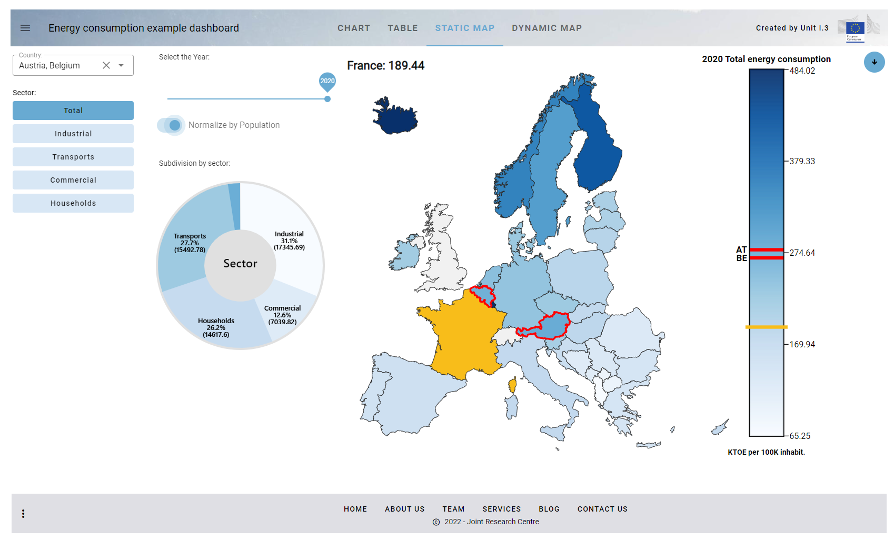
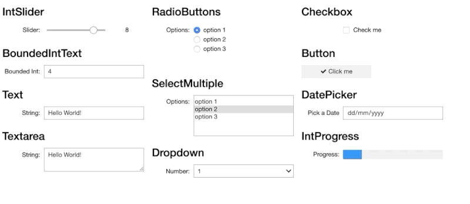
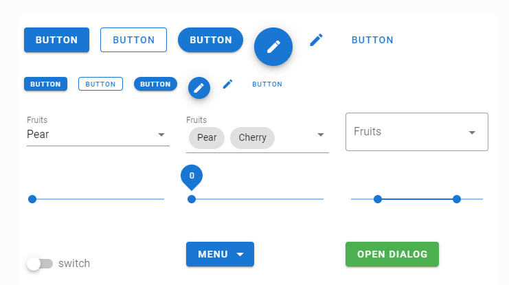

.. image:: figures/vois_horizontal_small.png

|

.. _Introduction:

============
Introduction
============

**VOIS** is a python library to simplify the creation of Voilà dashboards. It contains functions and classes that allow for fast development of 
data analytics dashboards containing charts (using `Plotly python library <https://plotly.com/python/>`_), datatables from `Pandas DataFrames <https://pandas.pydata.org/docs/reference/api/pandas.DataFrame.html>`_, `SVG plots <https://developer.mozilla.org/en-US/docs/Web/SVG>`_, and `interactive maps <https://jeodpp.jrc.ec.europa.eu/services/processing/interhelp/>`_.

The library contains an example dashboard that is built step by step using the functions and classes of the vois library. This example dashboard displays, in various modes, data on energy consumption of the european countries. Data used by the example dashboard was downloaded from EUROSTAT.

   
   Energy consumption example dashboard

Widgets libraries
-----------------

Widgets are the part of a GUI that allows the user to interface with the application. Widgets can make Jupyter notebooks look lively and interactive. Widgets are elements like buttons, drop-down list, slider, etc.

Widgets allow users to interact with the notebook, manipulate output according to the selection of widget and controlling events. It can be used to record the user’s input and can be implemented easily in a Jupyter notebook.

`Ipywidgets <https://ipywidgets.readthedocs.io/en/stable/index.html>`_  is an open-source python library that is used to generate different types of widgets and implement them in a Jupyter notebook. It is easy to use and provides a variety of interactive widgets. It is the "traditional" way to create GUI elements inside a Jupyter notebook, and is the first choice when a dashboard has to be built.

   Some of the standard ipywidgets GUI elements
   
   
The look&feel of the ipywidgets, however, cannot be customized, and when there is the need to create fancy looking applications in Jupyter or Voilà, more modern widgets library come to play their role.

For this reason **vois library** uses primarily Ipyvuetify as the widgets base library.

`Ipyvuetify <https://ipyvuetify.readthedocs.io/en/latest/index.html>`_ is a widget library for making modern looking GUI’s in Jupyter notebooks and dashboards (Voilà). It’s based on the Google material design philosophy best known from the Android user interface. A large set of widgets is provided with many widgets having multiple variants. 

   Ipyvuetify sample widgets

To explore which widgets are available in ipyvuetify and how to use them it is useful to view the `Vuetifyjs documentation <https://vuetifyjs.com/en/introduction/why-vuetify/>`_ where a very datailed description of the components can be found. You can browse examples on the left-hand side and see the source code by clicking on ‘< >’ on the top right-hand side of the example. By reading the `Usage section of ipyvuetify documentation <https://ipyvuetify.readthedocs.io/en/latest/usage.html>`_ you will be able to translate the examples to ipyvuetify.

When comparing ipyvuetify to ipywidgets, the standard widget library of Jupyter, ipyvuetify has a lot more widgets which are also more customizable and composable (in term of colors, shapes, functions, etc.) at the expense of a bit more verbosity in the source code. Using ipywuetify requires more effort compared to ipywidgets. For this reason, one of the main scope of this vois library is to simplify the use of ipyvuetify widget, so that the development of fancy Voilà dashboards becomes easier.

Packages
--------

The vois library is grouped in these packages:

+----------------------------------+-----------------------------------------------------------------------+
| :ref:`General package <General>` | Contains modules that define utilities functions and classes of       |
|                                  |                                                                       |
|                                  | general use (geojson, maps, svg, etc.)                                |
+----------------------------------+-----------------------------------------------------------------------+
| :ref:`Vuetify package <Vuetify>` | Contains modules that define classes to simplify the creation of      |
|                                  |                                                                       |
|                                  | GUI elements using ipyvuetify widgets                                 |
+----------------------------------+-----------------------------------------------------------------------+
| :ref:`Geo package <Geo>`         | Contains modules that enable the display of geospatial content on an  |
|                                  |                                                                       |
|                                  | interactive Map                                                       |
+----------------------------------+-----------------------------------------------------------------------+
