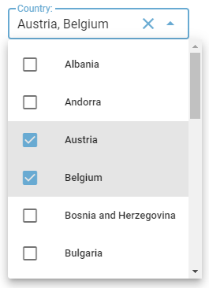
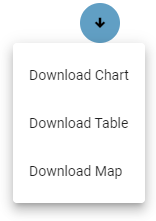
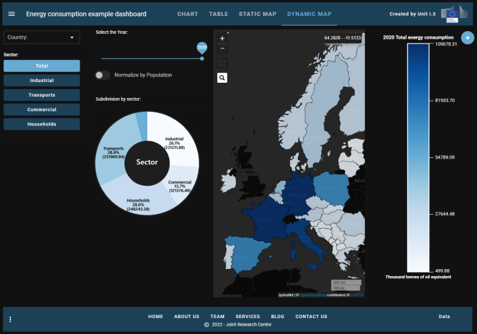

|

.. _Tutorial:

########
Tutorial
########

.. toctree::
   :maxdepth: 5

This tutorial will provide a step by step description of the construction of a dashboard to analyse and display data on Energy Consumption in Europe. The steps of the example dashboard are available as notebooks inside the **examples/EnergyConsumption** subfolder. The data for this example has been downloaded from EUROSTAT web site, in particular:

`File ten00124_linear.csv: Energy consumption data <https://ec.europa.eu/eurostat/databrowser/view/ten00124/default/map?lang=en>`_

   Input data for energy consumption in european countries
   
`File tps00001_tabular.tsv: Population data <https://ec.europa.eu/eurostat/databrowser/view/tps00001/default/table?lang=en>`_

   Input data for the population of european countries

Dashboard steps
===============

Scope of the example dashboard on "Energy Consumption in Europe" is to demonstrate a real example of a dashboard built using the **vois library**. 

The dashboard loads the input data from CSV files stored in the same folder of the notebooks using `Pandas <https://pandas.pydata.org/docs/getting_started/intro_tutorials/index.html>`_ and displays it in four modes: a chart, a table, a static map and a dynamic map. By "static map" it is meant that a drawing representing a map is displayed, without the possibility to do pan or zoom operations. This display mode is obtained using an SVG drawing. On the contrary, the "dynamic map" is based on a mapping widget that allows users to pan, zoom and click on the geographic features. 

Some widgets are added in the various steps to select countries and/or energy sectors and update the views accordingly.

The dashboard is created in 10 (+1) steps, here listed:

+----------+-----------------------------------------------+------------------------------------------------------------------------------------------------------------------------------------------------+----------------------------------------------------------------------------------+
|   Step   | Description                                   |   Link to dashboard                                                                                                                            |  Source code                                                                     |
+==========+===============================================+================================================================================================================================================+==================================================================================+
|     1    | Creation of the dashboard structure           |  `Link 1 <https://jeodpp.jrc.ec.europa.eu/eu/dashboard/voila/render/Vaas/EnergyConsumption/EnergyConsumption.1.ipynb>`_                        | `Source 1 <./_static/_static/EnergyConsumption.1.html>`_                         |
|          |                                               |                                                                                                                                                |                                                                                  |
|          | using the :py:class:`app.app` class           |                                                                                                                                                |                                                                                  |
+----------+-----------------------------------------------+------------------------------------------------------------------------------------------------------------------------------------------------+----------------------------------------------------------------------------------+
|     2    | Use Pandas to read the input CSVs and         |  `Link 2 <https://jeodpp.jrc.ec.europa.eu/eu/dashboard/voila/render/Vaas/EnergyConsumption/EnergyConsumption.2.ipynb>`_                        | `Source 2 <./_static/_static/EnergyConsumption.2.html>`_                         |
|          |                                               |                                                                                                                                                |                                                                                  |
|          | display the DataFrame as a table              |                                                                                                                                                |                                                                                  |
+----------+-----------------------------------------------+------------------------------------------------------------------------------------------------------------------------------------------------+----------------------------------------------------------------------------------+
|     3    | Add the filtering controls to the dashboard   |  `Link 3 <https://jeodpp.jrc.ec.europa.eu/eu/dashboard/voila/render/Vaas/EnergyConsumption/EnergyConsumption.3.ipynb>`_                        | `Source 3 <./_static/_static/EnergyConsumption.3.html>`_                         |
|          |                                               |                                                                                                                                                |                                                                                  |
|          | to select countries and sector                |                                                                                                                                                |                                                                                  |
+----------+-----------------------------------------------+------------------------------------------------------------------------------------------------------------------------------------------------+----------------------------------------------------------------------------------+
|     4    | Add the Plotly Bar Chart View                 |  `Link 4 <https://jeodpp.jrc.ec.europa.eu/eu/dashboard/voila/render/Vaas/EnergyConsumption/EnergyConsumption.4.ipynb>`_                        | `Source 4 <./_static/_static/EnergyConsumption.4.html>`_                         |
+----------+-----------------------------------------------+------------------------------------------------------------------------------------------------------------------------------------------------+----------------------------------------------------------------------------------+
|     5    | Add the SVG Static Map View                   |  `Link 5 <https://jeodpp.jrc.ec.europa.eu/eu/dashboard/voila/render/Vaas/EnergyConsumption/EnergyConsumption.5.ipynb>`_                        | `Source 5 <./_static/_static/EnergyConsumption.5.html>`_                         |
+----------+-----------------------------------------------+------------------------------------------------------------------------------------------------------------------------------------------------+----------------------------------------------------------------------------------+
|     6    | Add the Dynamic Map View                      |  `Link 6 <https://jeodpp.jrc.ec.europa.eu/eu/dashboard/voila/render/Vaas/EnergyConsumption/EnergyConsumption.6.ipynb>`_                        | `Source 6 <./_static/_static/EnergyConsumption.6.html>`_                         |
+----------+-----------------------------------------------+------------------------------------------------------------------------------------------------------------------------------------------------+----------------------------------------------------------------------------------+
|     7    | Add the functions for downloading chart,      |  `Link 7 <https://jeodpp.jrc.ec.europa.eu/eu/dashboard/voila/render/Vaas/EnergyConsumption/EnergyConsumption.7.ipynb>`_                        | `Source 7 <./_static/_static/EnergyConsumption.7.html>`_                         |
|          |                                               |                                                                                                                                                |                                                                                  |
|          | table and map                                 |                                                                                                                                                |                                                                                  |
+----------+-----------------------------------------------+------------------------------------------------------------------------------------------------------------------------------------------------+----------------------------------------------------------------------------------+
|     8    | Manage the parameters passsed in the URL      |  `Link 8 <https://jeodpp.jrc.ec.europa.eu/eu/dashboard/voila/render/Vaas/EnergyConsumption/EnergyConsumption.8.ipynb>`_                        | `Source 8 <./_static/_static/EnergyConsumption.8.html>`_                         |
|          |                                               |                                                                                                                                                |                                                                                  |
|          | and open external URLs                        |                                                                                                                                                |                                                                                  |
+----------+-----------------------------------------------+------------------------------------------------------------------------------------------------------------------------------------------------+----------------------------------------------------------------------------------+
|     9    | Add an interactive AnimatedPieChart in        |  `Link 9 <https://jeodpp.jrc.ec.europa.eu/eu/dashboard/voila/render/Vaas/EnergyConsumption/EnergyConsumption.9.ipynb>`_                        | `Source 9 <./_static/_static/EnergyConsumption.9.html>`_                         |
|          |                                               |                                                                                                                                                |                                                                                  |
|          | SVG to select the consumption sector          |                                                                                                                                                |                                                                                  |
+----------+-----------------------------------------------+------------------------------------------------------------------------------------------------------------------------------------------------+----------------------------------------------------------------------------------+
|  Final   | Add minipanel to footer bar and function to   |  `Link Final <https://jeodpp.jrc.ec.europa.eu/eu/dashboard/voila/render/Vaas/EnergyConsumption/EnergyConsumption.Final.ipynb>`_                | `Source final <./_static/_static/EnergyConsumption.Final.html>`_                 |
|          |                                               |                                                                                                                                                |                                                                                  |
|          | generate and download report in docx format   |                                                                                                                                                |                                                                                  |
+----------+-----------------------------------------------+------------------------------------------------------------------------------------------------------------------------------------------------+----------------------------------------------------------------------------------+
|  Final   | A "dark" version of the final dashboard       |  `Link Final dark <https://jeodpp.jrc.ec.europa.eu/eu/dashboard/voila/render/Vaas/EnergyConsumption/EnergyConsumption.Final.ThemeDark.ipynb>`_ | `Source final dark <./_static/_static/EnergyConsumption.Final.ThemeDark.html>`_  |
|          |                                               |                                                                                                                                                |                                                                                  |
|  dark    |                                               |                                                                                                                                                |                                                                                  |
+----------+-----------------------------------------------+------------------------------------------------------------------------------------------------------------------------------------------------+----------------------------------------------------------------------------------+

   
.. image:: figures/line.png

Step 1: Creation of the dashboard structure
-------------------------------------------

The initial step of the dashboard creates the graphical structure of the application using the :py:class:`app.app` class.

The first cell contains the customization of the settings that influence the appearance of all the graphical widgets. Here the dark_mode flag is set to False and the main colors of the widgets are defined (settings.color_first and settings.color_second), by selecting two shades of blue/cyan. Then the flag that defines if the button shape is round is set to False (so the buttons will have a 'squared' shape in this dashboard). See :py:mod:`settings` for reference::

        from vois.vuetify import settings
        settings.dark_mode      = False
        settings.color_first    = '#68aad2'
        settings.color_second   = '#d8e7f5'
        settings.button_rounded = False

Then the import of the libraries used in this version of the dashboard (ipywidgets and ipyvuetify)::

        from ipywidgets import widgets, Layout, HTML
        from IPython.display import display
        import ipyvuetify as v

Followed by the import of the app module of the vois library::

        from vois.vuetify import app
        
Ths second cell creates a global variable called **g_app** containing an instance of the :py:class:`app.app` class. All the aspect of the app appearance are defined in the call to **app.app()**: Title of the dashboard, list of tabs to display in the title bar, credits to show on the right of the title bar, content of the side panel and of the footer bar. To have a list of all the parameters, please consult the page on the :py:class:`app.app`.

Four callback functions are defined that simply display a **snackbar** message to the user when one of the buttons of the app interface is clicked (see :py:class:`snackbar.snackbar` module). This messages by default remain visible for 10 seconds and then automatically disappear. The user can click on the 'Close' button of the snackbar to close it before the 10 seconds timeout::

    # Click on a tab of the title
    def on_click_tab(arg):
        g_app.snackbar(arg)

    # Click on the credits text
    def on_click_credits():
        g_app.snackbar('Credits')

    # Click on the logo
    def on_click_logo():
        g_app.snackbar('LOGO')

    # Click on the footer buttons
    def on_click_footer(arg):
        g_app.snackbar(arg)

    g_app = app.app(title='Energy consumption example dashboard',
                    titlecredits='Created by Unit I.3',
                    titlewidth='60%',
                    footercolor='#dfdfe4',
                    footercredits='Data',
                    footercreditstooltip='Eurostat - European Commission',
                    footercreditsurl='https://ec.europa.eu/eurostat/data/database',
                    titletabs=['Chart', 'Table', 'Static Map', 'Dynamic Map'],
                    titletabsstile='font-weight: 700; font-size: 17px;',
                    dark=False,
                    backgroundimageurl='https://picsum.photos/id/293/1920/1080',
                    sidepaneltitle='Help',
                    sidepaneltext="Lorem ipsum dolor sit amet, consectetur adipiscing elit, sed do eiusmod tempor incididunt ut labore et dolore magna aliqua. Ut enim ad minim veniam, quis nostrud exercitation ullamco laboris nisi ut aliquip ex ea commodo consequat. Duis aute irure dolor in reprehenderit in voluptate velit esse cillum dolore eu fugiat nulla pariatur. Excepteur sint occaecat cupidatat non proident, sunt in culpa qui officia deserunt mollit anim id est laborum.",
                    sidepanelcontent=[v.Icon(class_='pa-0 ma-0 ml-2', children=['mdi-help'])],
                    onclicktab=on_click_tab,
                    onclickcredits=on_click_credits,
                    onclicklogo=on_click_logo,
                    onclickfooter=on_click_footer)

    g_app.show()

After the two cells are executed, this is the appearance of the dashboard:

   Appearance of the dashboard on step 1

The title bar and the footer bar are displayed, while the central part of the dashboard is empty. In the following steps this part will be filled with visualisations of the input datasets and widgets controls to allow for selections and filtering of input data.

The side panel of the application is already working: it can be opened by clicking on the top-left icon in the title bar. 

   Opening the sidePanel to show Help content

The button 'Data' displayed in the bottom-right corner of the footer bar is working and opens the EUROSTAT web page in another tab of the browser.

.. image:: figures/line.png

Step 2: Use Pandas to read the input CSVs and display the DataFrame as a table
------------------------------------------------------------------------------

The second step uses the Pandas library to read the input CSVs and display the DataFrame as a table.

In the first cell, the import of the Pandas library is added::

    import pandas as pd
    
Followed by the import of the datatable module of the vois library::

    from vois.vuetify import app, datatable
   
Then the import of the local module EnergyConsumption.py is added. This module contains the python code for loading the input data:: 

    import EnergyConsumption
    
Here is the code code of the EnergyConsumption.py module::

    # Loads input data and returns a pandas dataframe
    def loadData():
        # Load energy data
        df = pd.read_csv('./ten00124_linear.csv')

        # Remove columns that are not useful
        df.drop(['OBS_FLAG'], axis=1, inplace=True)

        # Assign Country to df
        df['Country'] = df['geo'].map(code2name)    

        # Load population data
        dfpop = pd.read_csv('./tps00001_tabular.tsv', delimiter='\t')

        # Dict key=Code2char  value=Population
        countrypop = {}

        dfpop.rename(columns={'freq,indic_de,geo\TIME_PERIOD': 'geo'}, inplace=True)
        columns = dfpop.columns
        for index, row in dfpop.iterrows():
            geo = row['geo'].split(',')[2]
            for col in reversed(columns):
                if len(row[col]) > 2:
                    pop = int(row[col].split(' ')[0])
                    if pop > 0:
                        countrypop[geo] = pop
                        break

        # Assign population to df
        df['Population2021'] = df['geo'].map(countrypop)

        return df

After reading the two datasets, the loadData function adds a new column named 'Population2021' to the Pandas DataFrame by taking the rightmost (i.e. more recent) column for each country that contains valid data. In order to purge unnecessary data, some of the columns of the input dataset that contain not useful data (like the 'siec' and the 'unit' columns) could be removed from the Pandas DataFrame. The DataFrame returned by the call to the EnergyConsumption.loadData function is used in all the subsequent steps of the example dashboard and is stored in the global variable named **g_df**::

    g_df = EnergyConsumption.loadData()

A third cell is added to the notebook, before the creation of the **g_app** instance, to display the global dataframe **g_df** inside the Output content of the app instance (see :py:attr:`app.app.outcontent`)::

    def displayDatatable():
        g_app.outcontent.clear_output(wait=True)
        d = datatable.datatable(data=g_df, height='800px')
        with g_app.outcontent:
            display(d)

Here the **g_app.outcontent** is the main Output widget that covers all the empty space between the title bar and the footer bar of the app instance. Please note the usage of the :py:class:`datatable.datatable` class to display the Pandas DataFrame as a datatable.

.. note::
    The **clear_output** method of the ipywidgets.Output class takes an optional parameter named **wait** of type boolean. If this parameter is set to True, the Output widget is not cleared immediately, but only when other content is displayed in the widget. This allows for smooth transitions among different contents and avoids the effect of 'flickering'. For additional info, see `ipywidgets documentation: Output widgets: leveraging Jupyter’s display system <https://ipywidgets.readthedocs.io/en/stable/examples/Output%20Widget.html>`_

In the last cell of the notebook, the displayDatatable() function is called, just after the creation of the **g_app** instance.

   Appearance of the dashboard on step 2

.. image:: figures/line.png

Step 3: Add the filtering controls to the dashboard to select countries and sector
----------------------------------------------------------------------------------

The third step adds the filtering controls to the dashboard to select countries and sector, so that the Pandas DataFrame can be browsed per country and per energy sector.

In the first cell of the notebook, the import of selectMultiple, label and toggle widgets is added::

    from vois.vuetify import app, selectMultiple, label, datatable, toggle
    
A cell is added in second position in the notebook. It contains code to create the ipywidgets.Output widgets that subdivide the space of the dashboard in parts for specific usage::

    #border = '1px solid lightgrey'
    border = 'none'

    # Dimensioning
    widthinpx     = 260
    widthControls = '%dpx' % widthinpx

    heightinpx = 830
    height     = '%dpx' % heightinpx

    height_net = '%dpx' % (heightinpx-10)

    outControls = widgets.Output(layout=Layout(width=widthControls, min_width=widthControls, height=height, border=border))
    outDisplay  = widgets.Output(layout=Layout(width='90%', height=height, border=border))

In the code, some dimensioning in width and height is defined (expressed in pixels), and two Output widgets are created. The  first is named **outControls** and will host some widgets to select the country and the energy sector that originates the consumption (industrial, commercial, etc.). The second Output widget is called **outDisplay** and will contain the visualisation defined by the user acting on the controls.

Interesting to note is the usage of the width in pixels for outControls and the with in percentage for the outDisplay. Combining it with the layout.min_width setting, this allows for having a outControls widget of fixed horizontal dimension of 260 pixels, while the outDisplay will  occupy the remaining part of the page, whatever is the total dimension of the screen (fullHD, table, smartphone, etc.).

Also interesting is the first line of the cell where the variable **border** is defined to be 1 pixel and grey. If this line is uncommented, and the following one is commented, the border of the two Output widgets will become visible and this can be useful during the development of the dashboard or for debugging purpose to check that their dimensions behave correctly. This can be achieved also adding a new cell in the notebook and executing these commands::

    outControls.layout.border = '1px solid grey'
    outDisplay.layout.border = '1px solid grey'

The cells added in the central part of the notebook will fill the two Output widget with the content. The display of these widgets inside the **g_app.outcontent** is done by this line added in the last cell of the notebook, just after the creation of the app.app instance::

    with g_app.outcontent:
        display(widgets.HBox([outControls,outDisplay]))

This code displays the two Output widget using the ipywidgets.HBox method that serves to display two or more widgets side by side in the same horizontal line (see `ipywidgets documentation: Container/Layout widgets <https://ipywidgets.readthedocs.io/en/latest/examples/Widget%20List.html#Container/Layout-widgets>`_ )

Following the cell that loads the input data, a new cell is added that defines some global variables::

    g_countries  = []    # Selected countries codes
    g_dtfiltered = None  # Filtered dataframe
    g_currentgeo = ''    # list of comma-separated names of the selected countries
    g_sector     = 'FC_E'
    g_units      = 'Thousand tonnes of oil equivalent'
    g_year       = g_df['TIME_PERIOD'].max()

    # Ordered list of sectors
    g_sectors = ['FC_E', 'FC_IND_E', 'FC_TRA_E', 'FC_OTH_CP_E', 'FC_OTH_HH_E']

    # Short names of the sectors
    g_sectorTitle = {
                     'FC_E':        'Total',
                     'FC_IND_E':    'Industrial',
                     'FC_TRA_E':    'Transports',
                     'FC_OTH_CP_E': 'Commercial',
                     'FC_OTH_HH_E': 'Households',
                    }

    # Long names of the sectors
    g_sectorName = {
                    'FC_E':        'Total energy consumption',
                    'FC_IND_E':    'Industrial energy consumption',
                    'FC_TRA_E':    'Transports energy consumption',
                    'FC_OTH_CP_E': 'Commercial energy consumption',
                    'FC_OTH_HH_E': 'Households energy consumption',
                   }
                   
In particular **g_sector** is a list of the codes of the energy sectors, as they appear in the columns of the input Pandas DataFrame, while **g_sectorTitle** and **g_sectorName** are two dictionary to retrieve the short and long name of a sector given its code.

The following cell creates some widgets to filter the input data. A first widget is a :py:class:`selectMultiple.selectMultiple` instance to select one or more countries. When no country is selected, the total data for Europe27 will be displayed, while when a valid selection is done, only the rows of the **g_df** Pandas Dataframe related to the selected countries will be displayed. This widget is created with the following instruction::

    selcountry  = selectMultiple.selectMultiple('Country:', EnergyConsumption.eunames, width=widthinpx-30,
                                                mapping=countries_mapping, onchange=onchange_country, marginy=2)

   selectMultiple widget for countries

The values displayed by the selectMultiple widget will be the EUROSTAT Country Names (content of the variable EnergyConsumption.eunames taken from the svgMap module and derived from the `EUROSTAT Country Codes <https://ec.europa.eu/eurostat/statistics-explained/index.php?title=Glossary:Country_codes>`_) while the mapping with the function **countries_mapping** will convert the name of the countries to their corresponding codes. If name is None the function returns the code for EU27.

The **onchange_country** function is called every time the user makes a selection in the country widget and it changes the value of the global variable **g_countries** to be the list of the codes of the selected countries. Then the UpdateDataframe function is called to update the visualisation::

    # Selection of a country
    def onchange_country():
        global g_countries
        g_countries = selcountry.value
        UpdateDataframe()
        displayDatatable()

A second widget is created as a :py:class:`toggle.toggle` instance to display buttons (displayed in vertical mode) for the energy sectors::

    selsector = toggle.toggle(0,
                              [g_sectorTitle[x] for x in g_sectors], 
                              tooltips=[g_sectorName[x] for x in g_sectors],
                              onchange=onchange_sector,
                              row=False,
                              width=widthinpx-30)

   Toggle widget for sectors

Here the title of the sector is displayed in the buttons, while the full name of the sector is used as tooltip when the user hovers one of the buttons.

The **onchange_sector** function is called every time the user makes a selection in the sector widget and it changes the value of the global variable **g_sector** to be the code of the selected sector. Then the UpdateDataframe function is called to update the visualisation::

    # Selection of a sector
    def onchange_sector(value):
        global g_sector
        g_sector = g_sectors[value]
        UpdateDataframe()
        displayDatatable()
    
The **UpdateDataframe** is responsible for creating a filtered version of the Pandas DataFrame to contain only the rows corresponding to the user selections in the selectMultiple and toggle widgets::

    # Update the filtered dataframe
    def UpdateDataframe():
        global g_dtfiltered, g_currentgeo

        # Filter dataset on country and sector
        if len(g_countries) == 0:
            codes = ['EU27_2020']
            g_currentgeo = 'Europe27'
        else:
            codes = g_countries
            g_currentgeo = ', '.join([EnergyConsumption.code2name[x] for x in g_countries])

        g_dtfiltered = g_df[(g_df['geo'].isin(codes))&(g_df['nrg_bal']==g_sector)].copy()
        g_dtfiltered.rename({'TIME_PERIOD': 'Year', 'OBS_VALUE': g_units}, axis=1, inplace=True)

This function updates the global variable **g_dtfiltered** to contain only the rows where the 'geo' column contains one of the codes of the selected countries and where the 'nrg_bal' column corresponds to the selected energy sector.

Finally, the **outControls** widget is filled with the controls::

    outControls.clear_output()
    with outControls:
        display(selcountry.draw())
        display(labelEmpty.draw())
        display(labelSector.draw())
        display(selsector.draw())

Since the widget are positioned in vertical one after the other, 4 simple calls to the display method are used. As an altenative one could have used the ipywidgets.VBox layout widget to get the same result. Please note the usage of the **draw()** method which is the method that all the widgets of the vois library implement to return a real instance of the underlining ipyvuetify widget to be displayed.

This is the apperance of the dashboard after the execution of the Step 3 notebook cells:

   Appearance of the dashboard on step 3

.. image:: figures/line.png

Step 4: Add the Plotly Bar Chart View
-------------------------------------

The 4th step adds the Plotly Bar Chart View to the dashboard.

In the first cell of the notebook, the import of the plotly library is added::

    import plotly.express as px
    import plotly.graph_objects as go

Here **px** is the `Plotly Express version of the Plotly API <https://plotly.com/python/plotly-express/>`_, while **go** is the `Plotly Graph Objects API <https://plotly.com/python/graph-objects/>`_. Both versions of the library are used in this example.

In the cell containing the global variables, a new variable is added, storing the color sequence selected from those available in the Plotly library (see `Discrete Color Sequences in Plotly Express <https://plotly.com/python/discrete-color/#color-sequences-in-plotly-express>`_ and `Built-In Sequential Color scales <https://plotly.com/python/builtin-colorscales/#builtin-sequential-color-scales>`_)::

    # Color sequence to use in the Plotly chart
    g_colorsequence = px.colors.sequential.Blues[::-1]

A new cell is added to the notebook to define the python function responsible for the update of the **outDisplay** Output widget with a Plotly Bar chart::

    def displayChart():
        global g_last_fig

        outDisplay.clear_output(wait=False)
        with outDisplay:
            title = g_sectorName[g_sector] + ' for ' + g_currentgeo
            if len(g_countries) <= 1:
                g_last_fig = px.bar(g_dtfiltered, x='Year', y=g_units, color="Country", template='plotly_white', text_auto=True, color_discrete_sequence=g_colorsequence)
                g_last_fig.update_xaxes(tickvals=g_dtfiltered['Year'])
            else:
                g_last_fig = go.Figure()
                i = 0
                allyears = set()
                for code in g_countries:
                    dfsel = g_dtfiltered[g_dtfiltered['geo']==code]
                    years = dfsel['Year'].unique()
                    allyears.update(years)
                    g_last_fig.add_trace(go.Bar(x=years, y=dfsel[g_units], name=EnergyConsumption.code2name[code], textposition="inside", texttemplate="%{y}", marker_color=g_colorsequence[i]))
                    i += 1
                    i = i % len(g_colorsequence)
                g_last_fig.update_layout(barmode='group', template='plotly_white', legend_title='Country', xaxis_title="Year", yaxis_title="Thousand tonnes of oil equivalent")
                g_last_fig.update_xaxes(tickvals=sorted(list(allyears)))

            g_last_fig.update_layout(height=heightinpx-10, margin=dict(t=84, l=0, r=0, b=0), title={'text': title})
            g_last_fig.show(config={'displaylogo': False, 'displayModeBar': False})

The **displayChart** function updates the **outDisplay** Output widget by clearing its content and replacing it with a Plotly Figure object. In case a single country is currently selected or no countries are selected, the chart is created using the `px.bar interface <https://plotly.com/python/bar-charts/>`_, while in case two or more countries are selected, the Figure is created by adding one **trace** for each country. Each of the traces are created using the `go.bar interface <https://plotly.com/python/bar-charts/#basic-bar-charts-with-plotlygraphobjects>`_. The Figure is stored in the global variable **g_last_fig** to be used in the next steps for the download operations.

In this step of the dashboard the tabs that are present in the title bar are managed. In particular, the **on_click_tab** function is now modified to manage the display of the 'Chart' or 'Table' view of the filtered dataset::

    # Click on a tab of the title: change the current view
    def on_click_tab(arg):
        global g_view
        if arg == 'Chart':
            g_view = 0
        elif arg == 'Table':
            g_view = 1
        else:
            g_app.snackbar(arg)
        displayCurrentView()
        
This function sets the global variable **g_view** to the correct value (0=Chart, 1=Table, 2=Static Map, 3=Dynamic Map) and calls the **displayCurrentView** function that is responsible for deciding which display function to call::

    # Display the current view in the outDisplay
    def displayCurrentView():
        if g_view == 0:
            displayChart()
        elif g_view == 1:
            displayDatatable()
        elif g_view == 2:
            pass
        else:
            pass

At this stage the dashboard looks like:

   Appearance of the dashboard on step 4

.. image:: figures/line.png

Step 5: Add the SVG Static Map View
-----------------------------------

This step adds the SVG Static Map View to the dashboard. This type of map represents the countries of Europe as a drawing, without any possibility of doing pan or zoom operations.

In the first cell the list of modules imported from the vois library is updated::

    from vois.vuetify import app, selectMultiple, label, datatable, toggle,
                                     tooltip, slider, switch
    from vois import svgMap

Two new Output widgets are created. They will partition the **outDisplay** Output in a left part containing controls to customize the Map views, and a right part to display the Map view itself::

    outMapControls = widgets.Output(layout=Layout(width=widthControls, min_width=widthControls, 
                                                  height=height_net, border=border))
    outMap         = widgets.Output(layout=Layout(width='90%', height=height_net, border=border))

Then the controls are created::

    labelYear  = label.label('Select the Year:', textweight=400, height=26, margins=3, margintop=0)
    sliderYear = slider.slider(g_year, g_minyear,g_maxyear, onchange=onchange_year)

    popswitch = switch.switch(g_usepop, "Normalize by Population", onchange=on_popswitch_change)

The :py:class:`slider.slider` instance will enable the user to select the year to be displayed on the map, and the :py:class:`switch.switch` instance is meant to enable the display of data normalized by the population of the respective country (i.e. energy consumption per 100K inhabitants).

When the user changes one of these settings, these two functions are called to update the Map view::

    # Selection of a year
    def onchange_year(value):
        global g_year
        g_year = value
        UpdateDataframe()
        displayCurrentView()

    # Switch among total values or values normalized by population
    def on_popswitch_change(arg):
        global g_usepop
        g_usepop = not g_usepop
        UpdateDataframe()
        displayCurrentView()

The functions **displayCurrentView** and **on_click_tab** are updated to manage the selection of the 'Static Map' tab in the title bar::

    def displayCurrentView():
        if g_view == 0:
            displayChart()
        elif g_view == 1:
            displayDatatable()
        elif g_view == 2:
            displayStaticMap()
        else:
            pass

    ...
    
    g_maintabs = ['Chart', 'Table', 'Static Map', 'Dynamic Map']

    # Click on a tab of the title: change the current view
    def on_click_tab(arg):
        global g_view
        if arg == g_maintabs[0]:
            g_view = 0
        elif arg == g_maintabs[1]:
            g_view = 1
        elif arg == g_maintabs[2]:
            displayMapControls()
            g_view = 2
        else:
            displayMapControls()
            g_view = 3
        displayCurrentView()        

A new global variable named **g_maintabs** is added to store the names of the 4 tabs in the Title Bar so that those strings are written in a single place and their management becomes easier in case of changes.

The **displayStaticMap** function is a new function to update the Map Output with a static map of Europe. It is created by deriving a **dfmap** Pandas Dataframe where the 'value' column is the total consumption or the consumption per 100K inhabitants, depending on the curren status of the population switch. The map is calculated using the :py:func:`svgMap.svgMapEurope` that returns a string in SVG (see `SVG: Scalable Vector Graphics <https://developer.mozilla.org/en-US/docs/Web/SVG>`_). This string is displayed using call to display(HTML())::

    def displayStaticMap():
        global g_last_svg

        # Prepare the pandas dataframe
        dfmap = g_df[(g_df['TIME_PERIOD']==int(g_year))&(g_df['nrg_bal']==g_sector)].copy()
        dfmap = dfmap[dfmap['geo'].isin(svgMap.country_codes)]
        if g_usepop:
            dfmap['value'] = 100000.0 * dfmap['OBS_VALUE'] / dfmap['Population2021']
            legendunits = 'KTOE per 100K inhabit.'
        else:
            dfmap['value'] = dfmap['OBS_VALUE']
            legendunits = g_units

        colorlist = g_colorsequence[::-1]   # From lighter to darkest!

        # Display the map
        outMap.clear_output(wait=True)
        with outMap:
            selected = []
            if g_countries == ['EU27_2020']: selected = []
            else:                            selected = g_countries

            g_last_svg = svgMap.svgMapEurope(dfmap, code_column='geo', value_column='value', codes_selected=selected, stroke_selected='red',
                                             colorlist=colorlist, stdevnumber=2.0, 
                                             onhoverfill='#f8bd1a', width=1480-2*widthinpx, stroke_width=3.0, hoveronempty=False, 
                                             legendtitle=str(g_year) + ' ' + g_sectorName[g_sector], legendunits=legendunits)
            display(HTML(g_last_svg))

In the call to :py:func:`svgMap.svgMapEurope` function, the column named **geo** of the **dfmap** DataFrame is used to match the corresponding polygon using the `EUROSTAT Country Codes <https://ec.europa.eu/eurostat/statistics-explained/index.php?title=Glossary:Country_codes>`_, and the related numerical value taken from the **value** column is assigned to the polygon. With all the polygons having their values assigned, the mean and standard deviation of all the values are calculated, and the range of values [mean - 2*stddev, mean + 2*stddev] is linearly assigned to the input colorlist (the Plotly px.colors.sequential.Blues).

The codes of the countries selected in the selectMultiple object are passed to the svgMapEurope function to highlight in red the border of the countries on the map drawing and on the legend.

This is the apperance of the dashboard after the execution of the Step 5 notebook cells:

   Appearance of the dashboard on step 5

.. image:: figures/line.png

Step 6: Add the Dynamic Map View
--------------------------------

This step adds the Dynamic Map View to the dashboard. The Map is created using the `ipyleaflet widget library <https://ipyleaflet.readthedocs.io/en/latest/>`_ which is a porting into the Jupyter world of the widely used `Leaflet JS library <https://leafletjs.com/>`_. Maps created in this way allow the users to do panning and zooming operation and to click on the features displayed in the map to get information. Vois library has a :py:mod:`leafletMap` module that exports some functions for adding custom vector dataset to a ipyleaflet interactive map.

In the first cell of the notebook, some additional import commands are added::

    from ipyleaflet import basemaps
    from vois import svgMap, leafletMap, svgUtils, geojsonUtils

The basemaps module allows for the selection of a backdrop dataset to be displayed in a ipyleaflet map, while the modules :py:mod:`leafletMap` and :py:mod:`geojsonUtils` are used for importing a geospatial dataset in geojson format inside the map and :py:mod:`svgUtils` is used to display a graduated legend that helps in understanding the colors assigned to the country polygons.

The same Pandas DataFrame calculated in the previous step as input to the Static Map is used to define the colors to be assigned to the polygons of the Dynamic Map. For this reason some lines of code that in the previous step were written inside the **displayStaticMap** function, are now extrapolated and inserted in a new function that returns the DataFrame used by both the Static and the Dynamic Map::

    # Prepare the pandas dataframe for the Map display (returns a df)
    def dataframeForMap():
        dfmap = g_df[(g_df['TIME_PERIOD']==int(g_year))&(g_df['nrg_bal']==g_sector)].copy()
        dfmap = dfmap[dfmap['geo'].isin(svgMap.country_codes)]
        if g_usepop:
            dfmap['value'] = 100000.0 * dfmap['OBS_VALUE'] / dfmap['Population2021']
        else:
            dfmap['value'] = dfmap['OBS_VALUE']
        return dfmap

The important addition of this step of the dashboard is the **displayDynamicMap** function. Its main content is the creation of the Dynamic Map starting from the dfmap returned by the **dataframeForMap** function call and a geojson file named **ne_50m_admin_0_countries.geojson** that is stored under the **data** folder::

        g_map = leafletMap.geojsonMap(dfmap,
                                      './data/ne_50m_admin_0_countries.geojson',
                                      'ISO_A2_EH',
                                      code_column='geo',
                                      value_column='value',
                                      codes_selected=selected,
                                      stroke_selected='red',
                                      colorlist=colorlist,
                                      stdevnumber=2.0,
                                      stroke_width=0.6,
                                      stroke='#010101', 
                                      width='70%',
                                      height=height,
                                      center=g_center,
                                      zoom=g_zoom,
                                      basemap=basemaps.Esri.WorldTopoMap,
                                      style      ={'opacity': 1, 'dashArray': '0', 'fillOpacity': 0.85},
                                      hover_style={'opacity': 1, 'dashArray': '0', 'fillOpacity': 0.99})

The **ne_50m_admin_0_countries.geojson** file was obtained from the `Natural Earth web site <https://www.naturalearthdata.com/downloads/>`_ and contains polygons for all the countries of the world. Unfortunately, this dataset uses a different coding for the countries: instead of the `EUROSTAT Country Codes <https://ec.europa.eu/eurostat/statistics-explained/index.php?title=Glossary:Country_codes>`_, it uses the `ISO 3166 standard <https://en.wikipedia.org/wiki/ISO_3166-1_alpha-2>`_ in the attribute named 'ISO_A2_EH'. The only practical consequence of having two sets of codes is that we have to cope with the two different codes that are assigned to Greece, which is coded **EL** in the EUROSTAT Country Code and **GR** in the ISO 3166 standard. This is managed by these two lines::

    dfmap['geo'].replace('EL','GR',inplace=True)
    
    selected = ['GR' if x=='EL' else x for x in selected]
    
These two lines substitute all occurrencies of 'EL' with 'GR' before calling the **leafletMap.geojsonMap** function.

These lines are added to observe any zoom and panning event in the dynamic map::

    g_map.observe(map_on_bounds_changed, names='bounds')
    
The **map_on_bounds_changed** is called any time that the map bounds (the east/west/south/north coordinates) are changed by a user action. Its code stores the center and the zoom level into two global variables **g_center** and **g_zoom**::

    # Store center and zoom at each zoom or panning of the user
    def map_on_bounds_changed(args):
        global g_center, g_zoom
        if not g_map is None:
            g_center = g_map.center
            g_zoom   = g_map.zoom

These values are then used any time that the Dynamic Map is updated (for instance when the user selects a different year) to recreate the new map with the same visible portion of the globe on the screen.

In the call to :py:func:`leafletMap.geojsonMap` function, the column named **geo** of the **dfmap** DataFrame is used to match the corresponding polygon using the `ISO 3166 standard <https://en.wikipedia.org/wiki/ISO_3166-1_alpha-2>`_, and the related numerical value taken from the **value** column is assigned to the polygon. With all the polygons having their values assigned, the mean and standard deviation of all the values are calculated, and the range of values [mean - 2*stddev, mean + 2*stddev] is linearly assigned to the input colorlist (the Plotly px.colors.sequential.Blues). A call to the :py:func:`svgUtils.graduatedLegend` is then used to create a graduated colors legend in SVG format to be displayed on the right side of the map::

    svg = svgUtils.graduatedLegend(dfmap, code_column='geo', value_column='value',
                                   codes_selected=selected, stroke_selected='red', 
                                   colorlist=colorlist, stdevnumber=2.0, 
                                   legendtitle=str(g_year) + ' ' + g_sectorName[g_sector],
                                   legendunits=legendForUnits(),
                                   fontsize=15, width=340, height=heightinpx-60)

This is the part of the new code that clears the **outMap** Output widget and then displays in it both the ipyleaflet Map and the SVG graduated color legend::

    # Display the legend
    outlegend = widgets.Output(layout=Layout(width='360px',height=height))
    with outlegend:
        display(HTML(svg))

    # Display the map
    outMap.clear_output(wait=True)
    with outMap:
        display(widgets.HBox([g_map,outlegend]))

The functions **displayCurrentView** and **on_click_tab** are updated to manage the selection of the 'Dynamic Map' tab in the title bar::

    def displayCurrentView():
        if g_view == 0:
            displayChart()
        elif g_view == 1:
            displayDatatable()
        elif g_view == 2:
            displayStaticMap()
        elif g_view == 3:
            displayDynamicMap()
    ...
    
    g_maintabs = ['Chart', 'Table', 'Static Map', 'Dynamic Map']

    # Click on a tab of the title: change the current view
    def on_click_tab(arg):
        global g_view, g_center, g_zoom
        if arg == g_maintabs[0]:
            g_view = 0
        elif arg == g_maintabs[1]:
            g_view = 1
        elif arg == g_maintabs[2]:
            displayMapControls()
            g_view = 2
        else:
            g_center = [56,11]
            g_zoom   = 4
            displayMapControls()
            g_view = 3
        displayCurrentView()

This is the apperance of the dashboard after the execution of the Step 6 notebook cells:

   Appearance of the dashboard on step 6

.. image:: figures/line.png

Step 7: Add the functions for downloading chart, table and map
--------------------------------------------------------------

The 7th step adds the functions for downloading chart, table and map view. 

The first cell of the notebook has some new import instructions::

    from datetime import datetime
    import io
    from cairosvg import svg2png
    
These new lines import modules used by the export code (svg2png is a module of the `cairosvg package <https://cairosvg.org/>`_ that converts SVG drawings to raster PNG format).
From the vois library, the module **fab** is imported::

    from vois.vuetify import app, selectMultiple, label, datatable, 
                                     toggle, tooltip, slider, switch, fab
                                     
**fab** is a module of the vois library that helps in creating Floating-Action-Button, i.e. buttons that are positioned in absolute mode on the page and that display a menu when hovered.

In the last cell of the notebook, just after the creation of the **g_app** instance, the download fab button is created::

    b = g_app.fab(left='96%', top='108px',
                  items=['Download Chart', 'Download Table', 'Download Map'],
                  onclick=[ondownloadCHART,ondownloadCSV,ondownloadMAP])
                  
This button is positioned in the topright portion of the screen and, when hovered, it shows three menu items for downloading the chart, the table and the map view.

   Download functions in the fab button

The corresponding download functions are declared in a new cell that contains these lines for the download of the Poltly chart::

    # Download Chart in PNG
    def ondownloadCHART():
        global g_view

        if g_view != 0:
            g_view = 0
            g_app.setActiveTab(g_view)
            on_click_tab(g_maintabs[g_view])

        if not g_last_fig is None:
            filename = 'Energy_' + datetime.today().strftime('%Y-%m-%d_%H-%M-%S')
            png = g_last_fig.to_image(format="png", width=1800)
            buf = io.BytesIO(png)
            buf.seek(0)
            barray = buf.read()
            #with open("chart.png", "wb") as file:
            #    file.write(barray)
            g_app.downloadBytes(barray,'%s.png' % filename)

These are the lines for the download of the tabular data in CSV format::

    # Download data in CSV format
    def ondownloadCSV():
        if not g_dtfiltered is None:
            filename = 'Energy_' + datetime.today().strftime('%Y-%m-%d_%H-%M-%S')
            df = g_dtfiltered.copy()
            df = df.reset_index(drop=True)
            buf = io.StringIO()
            df.to_csv(buf)
            buf.seek(0)
            text = buf.getvalue()
            g_app.downloadText(text,"%s.csv" % filename)

These are the lines to download the static map in PNG format::

    # Download Map in PNG
    def ondownloadMAP():
        global g_view

        g_app.dialogWaitOpen(text='Please wait for Map export...')

        if g_view != 2:
            g_view = 2
            g_app.setActiveTab(g_view)
            on_click_tab(g_maintabs[g_view])

        if not g_last_svg is None:
            filename = 'Energy_' + datetime.today().strftime('%Y-%m-%d_%H-%M-%S')
            svg_picture = g_last_svg
            svg_picture = svg_picture.replace('&nbsp;','&amp;nbsp;')
            svg_picture = svg_picture.replace('style="font-family: Roboto;"','')
            png = svg2png(bytestring=svg_picture, parent_width=1850, parent_height=600)
            buf = io.BytesIO(png)
            buf.seek(0)
            barray = buf.read()
            #with open("map.png", "wb") as file:
            #    file.write(barray)
            g_app.downloadBytes(barray,'%s.png' % filename)

        g_app.dialogWaitClose()

All the three download functions use the g_app methods :py:meth:`app.app.downloadText` and :py:meth:`app.app.downloadBytes` to download textual and binary files to the user local machine. The download of the Static Map, given that the download operations can take some seconds, is enclosed in the opening and closing of a :py:class:`dialogWait.dialogWait` invoked through the **g_app** instance::

    g_app.dialogWaitOpen(text='Please wait for Map export...')
    
    ...
    
    g_app.dialogWaitClose()
    

   Dialog-box displayed during the preparation of the data for the download of the Map

.. image:: figures/line.png

Step 8: Manage the parameters passed in the URL and open external URLs
-----------------------------------------------------------------------

This step adds the management of the parameters passsed in the URL and adds the opening of an external URLs when the user clicks on the EC logo in the title bar.

In developing real dashboards, there can be the need to manage the parameters passed in the URL that launched the application. It can be useful, for instance, to have a dashboard that provides different views of the same data, that are invoked by passing a parameter in the URL (for instance adding "?view=1" or "?view=2" to the URL). The python code of the dashboard can read these parameters and behave accordingly.

In order to add this new functionality, only the last cell of the notebook is modified in this 8th step. These lines of code are added just after the creation of the g_app and the fab button::

    # Read the URL parameters
    g_view   = int( g_app.urlParameter('view',   g_view))
    g_sector = str( g_app.urlParameter('sector', g_sector))
    g_year   = int( g_app.urlParameter('year',   g_year))
    g_usepop = bool(g_app.urlParameter('usepop', g_usepop))
    countries = str( g_app.urlParameter('countries', ''))
    if len(countries) <= 0: g_countries = []
    else:                   g_countries = countries.split(',')

The function :py:meth:`app.app.urlParameter` is called five times to read one URL parameter given its name. The values read from the URL are assigned to the global variables **g_view**, **g_sector**, **g_year**, **g_usepop** and **g_countries**. These global variables are used to set the active tab in the title bar of the g_app and to change the current value of the input widgets::

    g_app.setActiveTab(g_view)
    on_click_tab(g_maintabs[g_view])
    if g_sector in g_sectors:
        selsector.value = g_sectors.index(g_sector)
    sliderYear.value = g_year
    popswitch.value  = g_usepop
    selcountry.value = g_countries

The call to::

    UpdateDataframe()
    displayCurrentView()
    
updates the content displayed in the Output widgets according to the parameters passed in the URL.

To fully manage the URL parameters, it is also useful to update the URL in the browser address bar when the user operates on the widgets of the dashboard (it is a function similar to what is implemented by web sites like https://www.google.com/maps/: panning and zooming on the map updates the address bar of the browser by adding the center position and the zoom level of the map). This can be obtained by calling the helper function :py:meth:`urlUpdate` to pass the part of the URL to modify after the '?', as in the **urlUpdate** function::

    # Update the URL
    def urlUpdate():
        url = "?view=%d&countries=%s&sector=%s&year=%d&usepop=%d" % (int(g_view), 
                                                                     ",".join(g_countries),
                                                                     str(g_sector),
                                                                     int(g_year),
                                                                     int(g_usepop))
        g_app.urlUpdate(url)

The **urlUpdate** function is then called in all the functions that are executed when the user operates a selection on the widgets control, like in the functions **onchange_country**,  **onchange_sector**, **onchange_year**, **on_popswitch_change** and **on_click_tab**. In this way the URL displayed while the dashboard is active, always reflects the current status and can be, for instance copy/pasted to return to the same situation at a later stage or pass the complete URL to a colleague.

Finally, in the python function that manages the click on the logo, the call to open an external page is added, instead of simply send a snackbar message to the user, by using the :py:meth:`app.app.urlOpen` method of the :py:class:`app.app` class::

    # Click on the logo
    def on_click_logo():
        g_app.urlOpen('https://ec.europa.eu/info/index_en')

.. image:: figures/line.png

Step 9: Add an interactive AnimatedPieChart in SVG to select the consumption sector
-----------------------------------------------------------------------------------

The 9th step of the Energy Consumption dashboard adds an interactive AnimatedPieChart in SVG to select the consumption sector. The contribution of this addition is not important for the new functionality that it provides to the user, but as an example of an **interactive** SVG drawing inside the dashboard. The SVG added is 'interactive' in the sense that it is not only a drawing with an animation, but it manages user actions like click events, to provide some functionality to the application. This function is based on small but very important component called `ipyevents <https://github.com/mwcraig/ipyevents>`_, that is able to capture events occurring in the user client browser (like the user clicking on a slice of the pie), and pass it back to the python kernel to execute a function when it happens. This allows dashboard developers to complement their applications with reactive custom drawing that can fill the gaps of the standard charting libraries like Plotly or Bokeh: when a chart that is requested is not available in those libraries, an interactive SVG drawing can be added to the dashboard.

Here is a picture of the animated pie chart that is added in this step.

   The animated pie chart added to the dashboard

The chart graphically represents the subdivision of the energy consumptions for the current countries selection in the different sectors (transport, commercial, etc.). By clicking in one of the pie slices, the corresponding sector is selected (similarly to the clicking on the buttons of the sectors toggle widget)

Let's examine the code added to the notebook to obtain the new function. First of all, a new Output widget named outAnimation is created in the second cell of the notebbook and the Output widgets dimensioning for the Map and the Map controls are slightly modified::

    widthmapinpx     = 360
    widthMapControls = '%dpx' % widthmapinpx
    outMapControls = widgets.Output(layout=Layout(width=widthMapControls, min_width=widthMapControls, height=height_net, border=border))
    outMap         = widgets.Output(layout=Layout(width='90%', height=height_net, border=border))

    widthanimpx  = widthmapinpx - 20
    widthanim    = '%dpx' % (widthanimpx+10)
    outAnimation = widgets.Output(layout=Layout(width=widthanim, min_width=widthanim, height=widthanim, border=border))

Then, a new cell is added containing the code to create and display the animated pie chart::

    # Display Pie Chart animation
    def displayAnimation():

        outAnimation.clear_output(wait=True)

        if len(g_countries) == 0: codes = ['EU27_2020']
        else:                     codes = g_countries
        df_country_year = g_df[(g_df['geo'].isin(codes))&(g_df['TIME_PERIOD']==g_year)]
        df_country_year = df_country_year.groupby(["nrg_bal"])["OBS_VALUE"].sum().to_frame().reset_index()
        sectors = list(df_country_year['nrg_bal'])
        values  = list(df_country_year['OBS_VALUE'])

        chartvalues  = []
        chartlabels  = []
        chartsectors = []
        if 'FC_E' in sectors:
            totalindex = sectors.index('FC_E')
            totalvalue = values[totalindex]

            total = 0.0
            for s,v in zip(sectors,values):
                if s != 'FC_E':
                    total += v
                    chartvalues.append(round(v,2))
                    chartlabels.append(g_sectorTitle[s])
                    chartsectors.append(s)

            chartvalues.append(round(totalvalue - total,2))
            chartlabels.append('Other')
            chartsectors.append(None)

        def onclick(arg):
            newsector = chartsectors[arg]
            if not newsector is None:
                g_sector = newsector
                selsector.value = g_sectors.index(g_sector)

        out, txt = svgUtils.AnimatedPieChart(values=chartvalues, labels=chartlabels, decimals=1,
                                             centerfontsize=28, fontsize=16, textweight=500, colors=px.colors.sequential.Blues, backcolor='#e0e0e0',
                                             centertext='Sector', onclick=onclick, dimension=widthanimpx-15, duration=1.0)

        with outAnimation:
            display(out)

The first lines of the **displayAnimation** new function extract the information on sector consumptions from the current Pandas DataFrame **g_df**, to create a list of sector names (**chartlabels**) and a corresponding list of numerical values (**chartvalues**). Then the :py:meth:`svgUtils.AnimatedPieChart` method is called passing these two lists as input data for the creation of the pie chart. A local pyton function is also passed as the **onclick** parameter. This function will be called (thanks to the internal code of the :py:meth:`svgUtils.AnimatedPieChart` method that uses **ipyevents** to capture the events) at each click on the slices of the pie chart. The onclick function will receive as parameter the label of the clicked slice and this allows the function to update the value of the **selsector** toggle widget.

.. note::
   Please note that, given that the :py:meth:`svgUtils.AnimatedPieChart` method is meant to capture users events, it returns an Output widget instance. This Output widget is created internally and is passed to the ipyevents events manager to capture user clicks. For those interested in understanding how this works, pleas refer to the source code of the :py:meth:`svgUtils.AnimatedPieChart` method, and in particular these lines::
    
    d = Event(source=out, watched_events=['click'])
    
    def handle_event(event):
        ...
    
    d.on_dom_event(handle_event)
    

.. image:: figures/line.png

Step 10: Add minipanel to footer bar and the function to generate and download a report in docx format
------------------------------------------------------------------------------------------------------

The final step adds a minipanel to the footer bar and the function to generate and download a report in Microsoft Word **docx** format containing text, tables and images.

The minipanel is a small widget containing icons that can be added to the footer bar of a :py:class:`app.app` class instance. These are the lines of code added in the last cell of the notebook to add the minipanel in the creation of the global **g_app** instance::

    minipanelicons=['mdi-chart-bar',
                    'mdi-table-large',
                    'mdi-map-legend',
                    'mdi-file-chart-outline'],
    minipaneltooltips=['Download Chart',
                       'Download Table',
                       'Download Map',
                       'Generate Report in Word .docx format'],
    minipanellarge=True, minipanelopen=False,
    onclickminipanel=on_click_minipanel,

   The minipanel added to the footer bar of the application

The minipanel contains four icons, each icon has a tooltip text, and when clicking on one of the icons, the **on_click_minipanel** new function is called, which calls the correct download function, given the index of the clicked icon that it receives as parameter::

    # Click on the footer minipanel
    def on_click_minipanel(arg):
        if   arg == 0: ondownloadCHART()
        elif arg == 1: ondownloadCSV()
        elif arg == 2: ondownloadMAP()
        else:          ondownloadREPORT()
    
.. note::
    All the icons from https://materialdesignicons.com/ site can be used, just by prepending 'mdi-' to their name.
   
    All the free icons from https://fontawesome.com/ site can be used, just by prepending 'fa-' to their name.

To create and export a report in Microwoft Word docx format, these new imports are added in the first cell of the notebook, to load modules from the `python-docx package <https://python-docx.readthedocs.io/en/latest/>`_::

    from docx import Document
    from docx.shared import Inches

This is the new function **ondownloadREPORT** that is called from the minipanel::

    def ondownloadREPORT():
        global g_view

        if g_view != 0:
            g_view = 0
            g_app.setActiveTab(g_view)
            on_click_tab(g_maintabs[g_view])

        g_app.dialogWaitOpen(text='Please wait for Word .docx report generation...')

        document = Document()
        document.add_heading('Report from the Energy consumption dashboard', 0)

        # Add a table
        document.add_heading('Filtered table:', level=2)
        df = g_dtfiltered[['nrg_bal', 'siec', 'geo', 'Year', 'Thousand tonnes of oil equivalent', 'Country']]
        add_table(df, document)
        document.add_page_break()

        # Add chart as an image
        png = g_last_fig.to_image(format="png", width=1800)
        imagetitle = str(g_year) + ' ' + g_sectorName[g_sector] + ' in ' + legendForUnits() + ':'
        document.add_heading(imagetitle, level=2)
        file = io.BytesIO(png)     
        document.add_picture(file, width=Inches(7.0))

        # Add map as an image
        if g_last_svg is None:
            displayStaticMap()

        if not g_last_svg is None:
            imagetitle = str(g_year) + ' ' + g_sectorName[g_sector] + ' in ' + legendForUnits() + ':'
            document.add_heading(imagetitle, level=2)
            add_image(g_last_svg, document)   

        buf = io.BufferedRandom(io.BytesIO())
        document.save(buf)    
        buf.seek(0)

        barray = buf.read()
        g_app.downloadBytes(barray,'Energy.docx')

        g_app.dialogWaitClose()

The function creates an example report containing some text, a table and two images (the chart and the static map). Then the :py:meth:`app.app.downloadBytes` method is used to transfer the bytes of the report to the user local machine.

Step 10 dark: Creation of the "dark" version of the final dashboard
-------------------------------------------------------------------

It can be useful to be able to create Voilà dashboard that use the "Dark Theme". To obtain a "dark" dashboard, some additional steps have to be performed. First of all, the Step 10 example notebook EnergyConsumption.Final.ipynb has been copied to another notebook and named **EnergyConsumption.Final.ThemeDark.ipynb**. The first action to convert the dashboard to the "Dark Theme" is to edit the .ipynb file using the text editor and add this settings to the "metadata" part of the notebook JSON::

     ,
      "voila": {
       "theme": "dark"
      }

as shown in this screenshot:

   Open in editor the source JSON notebook and add the "voila" "theme" "dark" setting.

Then the first cell of the notebook is modified by adding the global variable **g_dark** with value True and changing **settings.dark_mode** to True. The first and second color are also changed, as well as the background color of the tooltips (see :py:mod:`settings`)::

    g_dark = True

    from vois.vuetify import settings
    settings.dark_mode         = g_dark
    settings.color_first       = '#68aad2'
    settings.color_second      = '#1c4056'
    settings.button_rounded    = False
    settings.tooltip_backcolor = '#424242'
    
Then, immediately after the import of the ipyvuetify package, the dark_mode is selected for the widgets of that library::

    # Set the dark theme for ipyvuetify!!!
    import ipyvuetify as v
    v.theme.dark = g_dark

The calls to :py:meth:`svgUtils.svgMapEurope` and to :py:meth:`svgUtils.graduatedLegend` need to have the dark parameter set to True, so that the border of the countries and the legends are displayed converting 'black' to 'white'. The same is done in the call to create the **g_app** instance of the :py:class:`app.app` class, to draw as white the texts of the title bar and of the footer bar::

    dark=g_dark,
    footerdark=g_dark,

The **template='plotly_dark'** parameter is added to the methods called from the Plotly library inside the **displayChart** function to select the dark theme.

Then the backcolor of the call to :py:meth:`svgUtils.AnimatedPieChart` in the **displayAnimation** function is changed, as well as the basemap for the Dynamic Map that is changed to **basemaps.CartoDB.DarkMatter**.

Here is the final dashboard changed to use the dark theme:

   Dark version of the final dashboard
