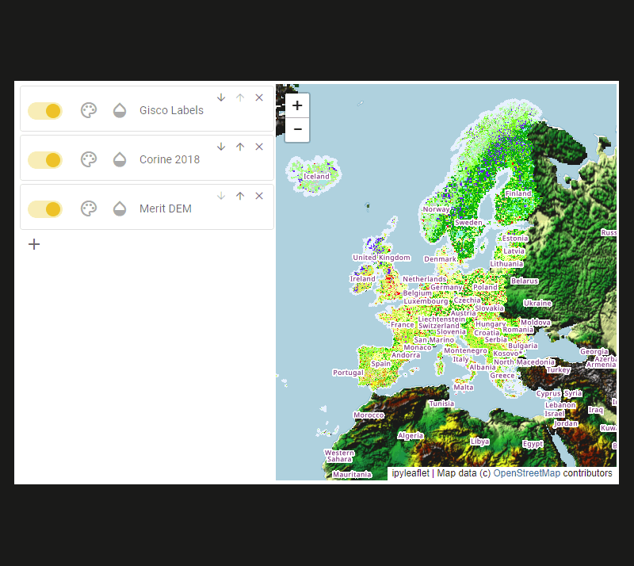

.. vois documentation master file, created by
   sphinx-quickstart on Fri May 13 06:44:52 2022.
   You can adapt this file completely to your liking, but it should at least
   contain the root `toctree` directive.

User Guide
==========

.. toctree::
   :maxdepth: 4

   1_intro
   2_tutorial
   3_reference
   4_help
   5_vaas
   6_license
   7_tables

